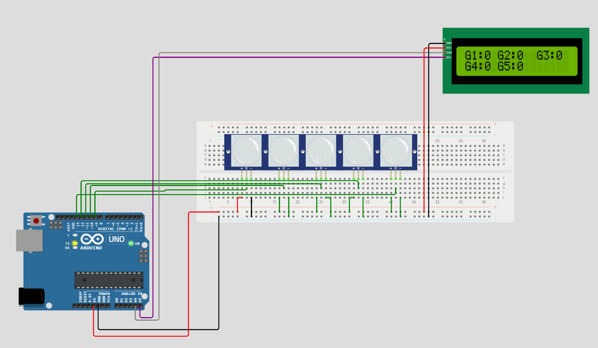
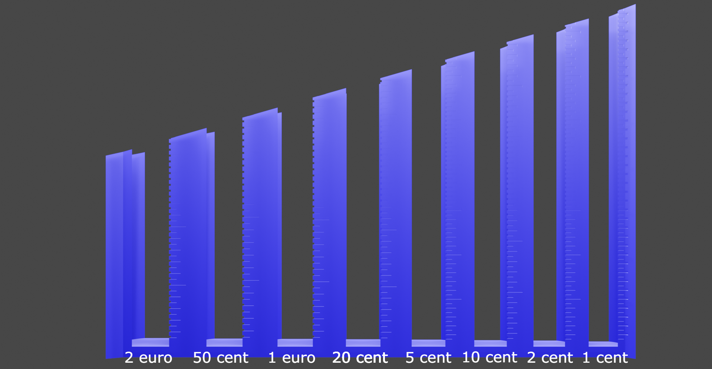
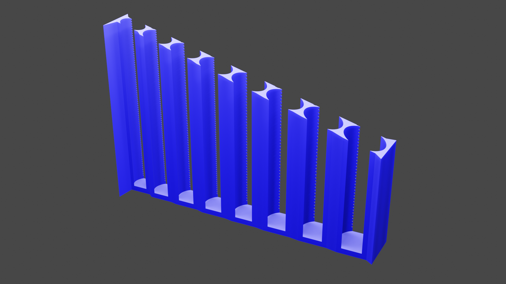
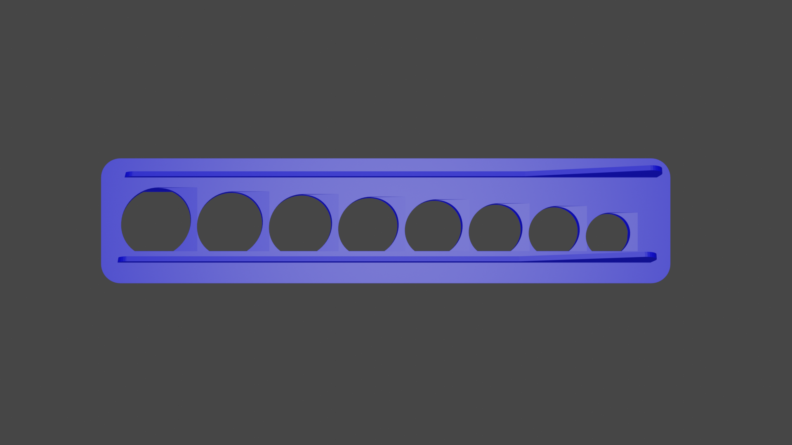
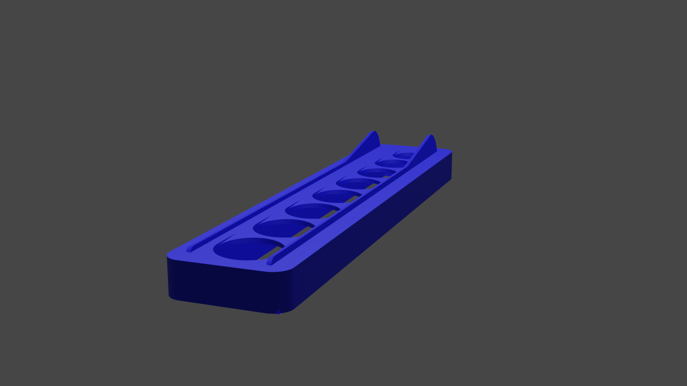
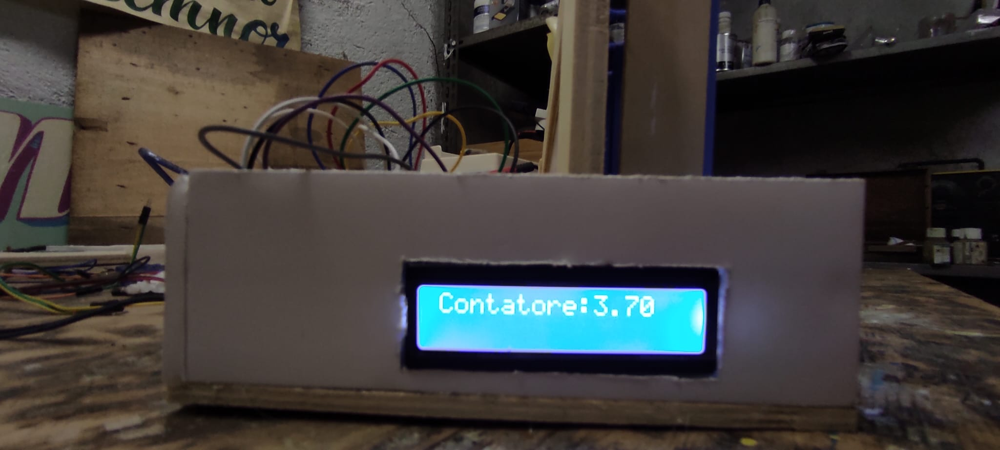
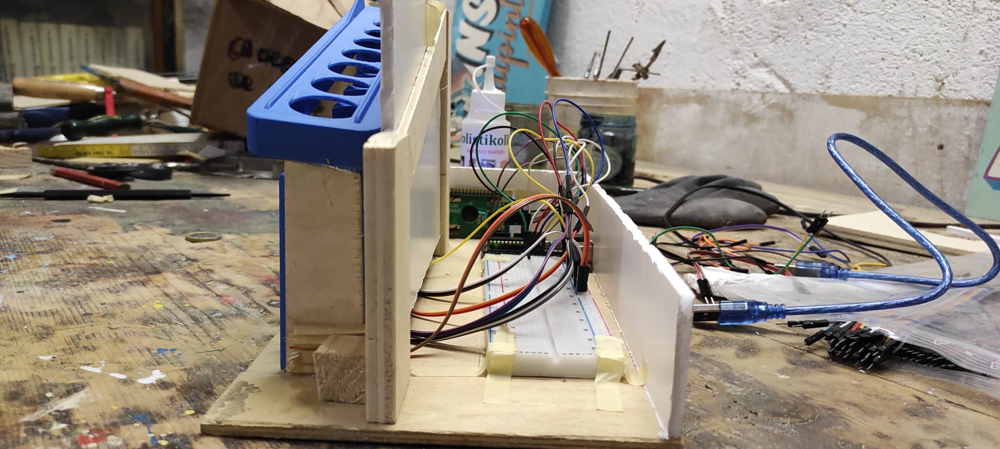
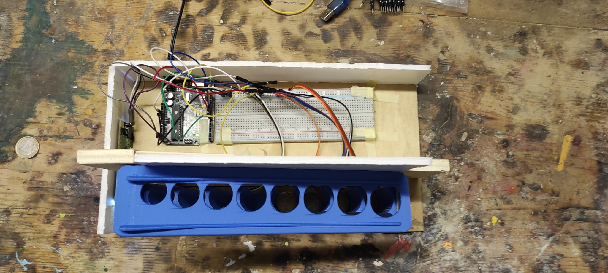
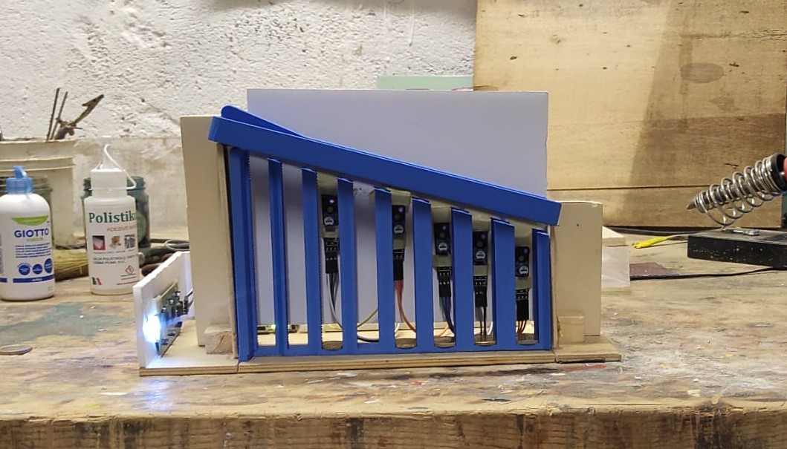
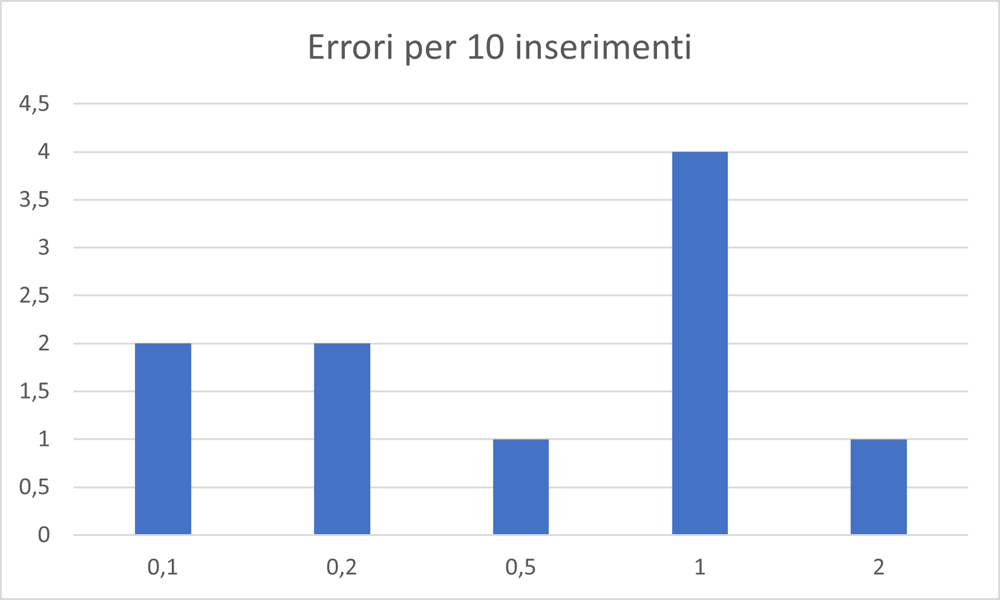

# Progetto Sistemi Embedded

Nome Progetto: Conta Monete
Autore: Martino Francesco Leone 
Descrizione: il progetto consiste in un Contatore di monete in valuta euro.

Lo scopo di questo progetto è realizzare una macchina in grado di contare e dividere le monete dell'utente suddividendole per tagli e restituire a schermo il numero delle monete inserite divise per tipo.

## Lista Materiale:

* 1 x Arduino Nano

* 5 x Angeek KY-033 - Modulo Sensore TCRT5000

* 1 x Freenove I2C LCD 1602 Module, New Type IIC TWI Serial 16x2 Display

## Schema

## Modelli Utilizzati

### Colonne

Componente Stampato in 3d che andrà a contenere le singole monete 

### Base

# Immagini

## Foto Progetto

### Problemi Rilevazione:

Una volta completato l'assemblaggio procediamo a verificare l'affidabilità della macchina testando il tasso di errore. 

Per questioni di tempo eseguiremo 10 test per singolo taglio di moneta e scoprire il tasso di errore.

> NOTA: non vengono considerati gli errori strutturali del sistema (es. moneta cade nella colonna sbagliata)

| Test N      | 0.1 | 0.2 | 0.5 | 1   | 2   |
| ----------- | --- | --- | --- | --- | --- |
| 1           | 1   | 1   | 1   | 1   | 1   |
| 2           | 1   | 1   | 1   | 0   | 1   |
| 3           | 1   | 1   | 1   | 1   | 1   |
| 4           | 0   | 1   | 1   | 1   | 1   |
| 5           | 1   | 1   | 1   | 1   | 1   |
| 6           | 0   | 1   | 1   | 0   | 1   |
| 7           | 1   | 1   | 1   | 0   | 1   |
| 8           | 1   | 0   | 1   | 1   | 1   |
| 9           | 1   | 0   | 1   | 1   | 0   |
| 10          | 1   | 1   | 0   | 0   | 1   |
| Total Error | 2   | 2   | 1   | 4   | 1   |

vediamo questi dati mostrati tramite un grafico 

notiamo che per qualche motivo il sensore delle monete da 1 euro  sia  quella più propensa al non rilevare la caduta.  Le cause devono ancora essere ancora trovate 

## Video progetto

[Video Presentazione Contamonete-Sistemi embedded - YouTube](https://youtu.be/x5DmvLtoh-8)

# Difficoltà riscontrate

1. Appesantimento del codice: La principale sfida è stata scrivere un codice efficiente in quanto, la caduta delle monete dura solo pochi millisecondi. È stato necessario assicurarsi che il codice non appesantisse il clock della scheda.

2. Monete sotto i 10 cent: I sensori kr-033 hanno difficoltà a rilevare elementi di piccole dimensioni, in particolare le monete da 1, 2 e 5 cent, a causa del loro spessore. Questo rende la loro implementazione problematica poiché ci sarebbe un rischio frequente di non rilevare correttamente le monete. Per questa ragione, a causa della mancanza di precisione e di sensori adatti, queste monete non verranno implementate.

3. Caduta delle monete: Dopo aver completato il progetto, è emerso un problema con il componente "base", che non fa cadere le monete correttamente, come mostrato nel video di segnalazione ([sistemi embedded-problema base - YouTube](https://youtu.be/bRrj2EUDvSM) )
   
   Per comprendere l’entità del problema segue una tabella che mostra un test
   su 10 lanci per monete seguito da un grafico che mostra il numero di errori per
   ogni moneta(aka; ogni sensore)

---

Link a repo: https://github.com/MartinWWDC/SitemiEmbedded
Licenza scelta: GNU GENERAL PUBLIC LICENSE version 3 (GPLv3)
Data *indicativa* di presentazione: settembre 2023

# Link utili

[Aceti Ceribelli / Progetto sistemi embedded / Relazione · GitLab](https://gitlab.di.unimi.it/aceti-ceribelli/progetto-sistemi-embedded/relazione)

[SistemiEmbedded · GitLab](https://gitlab.di.unimi.it/sistemiembedded)
