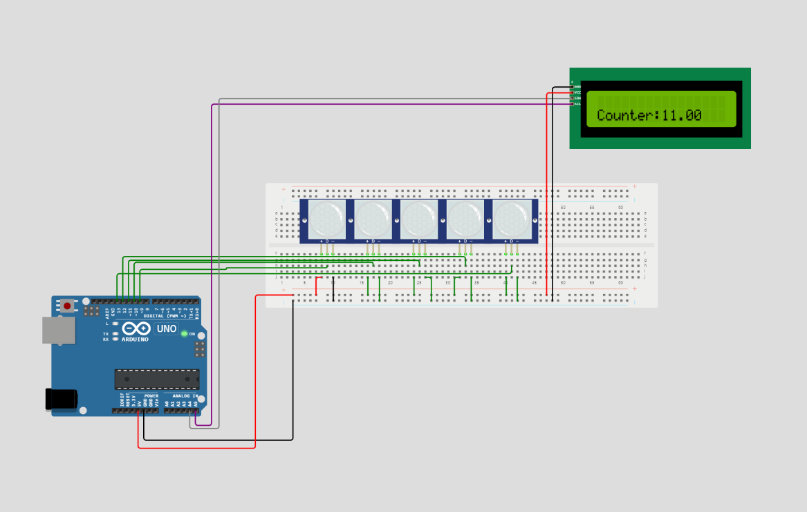

# Progetto Sistemi Embedded

Nome Progetto: Conta Monete
Autore: Martino Francesco Leone 
Descrizione: il progetto consiste in un Contatore di monete in valuta euro.

Lo scopo di questo progetto è realizzare una macchina in grado di contare e dividere le monete dell'utente suddivvidendole per tagli e restituire a schermo il valore complessivo delle monete inserite.

## Lista Materiale:

* 1 x Arduino Nano

* 5 x Angeek KY-033 - Modulo Sensore TCRT5000

* 1 x Freenove I2C LCD 1602 Module, New Type IIC TWI Serial 16x2 Display

## Schema

## Modelli Utilizzati

### Colonne

Componente Stampato in 3d che andrà a contenerere le singole monete 

### Base

base che permettera di far scorrore  una volta il clinata e di permettere una divisione dei coin

# Immagini

## Foto Progetto

## Video progetto

[Video Presentazione Contamonete-Sistemi embedded - YouTube](https://youtu.be/x5DmvLtoh-8)

# Difficoltà riscontrate

* **Appesantimento del codice:** la difficoltà principlae è stata riscontrata nella scrittura del codice in quanto,essendo che la caduta delle monete dura solo pochi millisecondi, è stato necessario assicurarsi di scrivere un codice suffficentemente efficente da non appesantire il clock della scheda
* **Monete sotto i 10 cent:** i sensori kr-033 hanno il problema di non essere molto precisi nel captare elementi di piccola dimensione, in particolare le monete da 1,2 e 5 cent dato il loro spessore risultano di difficile implementazione (in quanto si richierebbe molto spesso di incorrere nella macata rilevazione della moneta) per questo motivo per mancanza di precisione e mancanza di sensori  non verrà implementato 
* **Caduta Monete:** a progetto terminato è stato riscontrato un imperfezione nel componente "base" il quale non fa cadere correttamente le monete come espresso nel video segnalazione([sistemi ebedded-problema base - YouTube](https://youtu.be/bRrj2EUDvSM) )

Link a repo: https://github.com/MartinWWDC/SitemiEmbedded
Licenza scelta: GNU GENERAL PUBLIC LICENSE version 3 (GPLv3)
Data *indicativa* di presentazione: settembre 2023

# Link utili

[Aceti Ceribelli / Progetto sistemi embedded / Relazione · GitLab](https://gitlab.di.unimi.it/aceti-ceribelli/progetto-sistemi-embedded/relazione)

[SistemiEmbedded · GitLab](https://gitlab.di.unimi.it/sistemiembedded)
